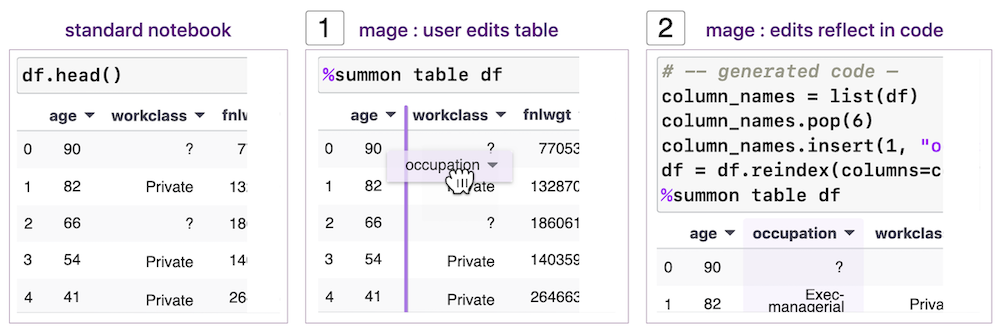
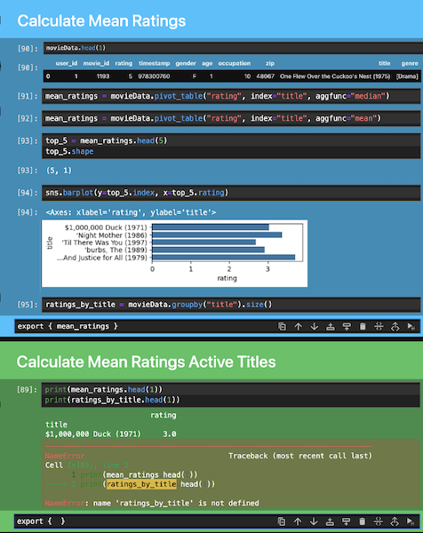
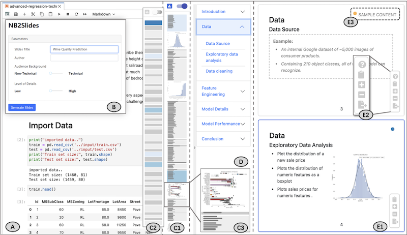

# W7 Computational Notebooks
#### Author: R. Chilukuri

### Blending Prose and Code
Standalone code can be messy and uncouth, a wall of text without explanation or understanding. The original programmer can have difficulty deciphering minimalist function and variable names as time passes. The problem compounds the more complex the program grows, and modifying and debugging become near impossible.

Thankfully, we can have comments in code and rich documentation outside of it to digest the program. But is it enough? Comments allow us to quickly explain and summarize code blocks and goals to help ourselves and others debug, test, and develop. We can also reference other components of the program to track the execution and make connections across the codebase. Rich typeset, graphical, and interactive documentation lets us explain the system by connecting disparate parts of the codebase, demonstrate use through examples and diagrams, and share information through unrestricted prose. The efficacy of these mediums depends on the users and it is often not easy to keep code, comments, and documentation in sync, and even more difficult to write accessible language.

The question becomes, how can we effortlessly blend prose and code to improve code readability, understanding, management, and development?

### Literate Programming
In 1984, Donald Knuth coined the term "literate programming", wherein the practitioner treats a program as a work of literature that focuses on explaining to humans what they want the computer to do. Knuth introduced WEB, a combined programming language and documentation system. The WEB file consists of mixed prose and code that is compiled to machine-readable code (TANGLE) and to human-readable text (WEAVE). WEAVE outputs an entire hyperlinked index of the named code blocks (called identifiers), and TANGLE allows one to inline code blocks by their identifiers. This identifier programming lets one quickly navigate the program and encourages updating descriptive prose as each annotation occurs once with its identifier. These rich descriptions and extensive up-to-date documentation also help with debugging and adding components. However, as Knuth notes, "WEB may be only for the subset of computer scientists who like to write and to explain what they are doing" (p. 15). The complexity and richness of the system does not lend itself well to those wishing to quickly prototype and iterate on their ideas, test small components of code, perform exploratory analyses, or visualize outputs.

### Computational Notebooks: The Past and The Present
While WEB never caught on, a widespread instance of the literate programming paradigm arrived as the computational notebook, documents that integrate prose, code, and results. Notebooks are divided into chunks of code or prose, called cells, that can be run and modified individually, producing output directly below the cell. The most ubiquitous and accessible of such notebooks is Jupyter, an open source project that can operate on any language with a kernel (backend that communicates with Jupyter) and runs in a web browser (Kluyver et al., 2016). Notebooks fill in the gap left by Knuth: anyone knowing a supported language and markdown can blend prose and code. While not a fully integrated documentation-code system, notebooks allow users to richly describe their development and research process. They even expand upon Knuth's WEB by allowing one to comment on both the code and its outputs. Further, the Jupyter project added extensions supporting sharing, reproducibility, and preservation: nbconvert converts the notebook into HTML, LaTeX, or PDF, nbviewer renders any web-hosted notebook into HTML, and Binder lets one share and run notebooks from a GitHub repository.

Notebooks are used extensively by scientific researchers, data workers, software developers, and instructors and students for their ease of prototyping, data exploration, testing, interactivity, and shareability, and there is a plethora of active research on improving their capabilities.

One notable limitation of Jupyter is the static outputs. Mage seeks to remedy this by acting as a reactive intermediary layer between the output GUI and code (Kery et al., 2020). Mage lets tool builders use its API to pass cell variables to-and-from the GUI via templates. For example, the authors show filtering a table in the GUI that propagates code into the cell. In the other direction, they show that modifying the bounds of a picture in code updates the displayed region in the GUI. Some applications to the machine learning workflow include dataset splitting with a slider that also visualizes the distributions in each split, and creating a confusion matrix to display misclassifications. Hence, mage helps to blend code and output.

One difficulty working with Jupyter notebooks is managing its state. Unlike standard programming, notebooks employ global variables that operate across cells, and users sparingly use functions so they can individually dissect code lines. Notebook users often have issues overwriting variables and executing cells out-of-order, making these globally scoped variables hazardous in large notebooks. Pagebreaks introduces scopes around groups of notebook cells for state management (Rawn & Chasins, 2025). A group's variables can only interact with a group later in the notebook if they are explicitly exported, thus solving the issue of conflicting names and the propagation of global variables.

Looking to delivering notebooks in forms for non-notebook users, Zheng et al. introduced NB2Slides in 2022 to generate data science presentations from computational notebooks. The user specifies the audience background and level of detail, and AI summarizes code and produces bullet points. After, the user manually refines the slides through the provided interface. This, however, relies on a notebook with non-excess code cells, documentation, and sections for each slide. Thus, while an effective and convenient system for standard data science tasks, it could be more useful with customization on the presentation outline and manual matching of slides to code.

### Computational Notebooks: Oh, the Places You'll Go!
We have discussed the gap between computational notebooks and the ideal of literate programming. Most developments have focused on improving the functionality of just the notebooks themselves. In the age of AI, even those without the flair or proclivity for literature can generate the prose of a notebook by analyzing the code cells and output, and collect the prose into documentation. As well, AI can translate the documentation and generate levels of complexity. The gap between notebooks as prototypes and final code remains, but we can envision tighter integration. It is common for programmers to copy code into notebooks to test and develop methods and then copy the result back. A fluid move between codebase and notebook, and between markdown cells and documentation, would promote notebooks to an eminent place in production code development.

### Conclusion
We have seen that code without prose can be a tangled mess. Knuth envisioned programs as works of literature that treat the natural language describing code as tantamount to the code itself. While computational notebooks do not quite fulfill this vision, they provide a convenient form for the masses. Notebooks can be used to develop sophisticated applications and documentation, and we can marry this process to production-level systems. AI can contribute to summarizing and preparing documentation, and if we integrate notebooks more tightly with our codebases, we can smoothly move between the two.

#### Author
Rohan Chilukuri is a Master's student in Computer Science at ETH Zürich focused on Machine Intelligence and Theoretical Computer Science. He has substantial experience working with computational notebooks for research and engineering in both academic and industry contexts.

### References

\[1] Knuth, D. E. (1984). Literate programming. The Computer Journal, 27(2), 97–111.

\[2] Kluyver, T., Ragan-Kelley, B., Pérez, F., Granger, B., Bussonnier, M., Frederic, J., Kelley, K., Hamrick, J., Grout, J., Corlay, S., Ivanov, P., Avila, D., Abdalla, S., Willing, C., & Jupyter Development Team. (2016). Jupyter Notebooks – A publishing format for reproducible computational workflows. In F. Loizides & B. Schmidt (Eds.), Positioning and Power in Academic Publishing: Players, Agents and Agendas (pp. 87–90). IOS Press.

\[3] Kery, M. B., Ren, D., Hohman, F., Moritz, D., Wongsuphasawat, K., & Patel, K. (2020). mage: Fluid moves between code and graphical work in computational notebooks. In Proceedings of the 33rd Annual ACM Symposium on User Interface Software and Technology (pp. 140–151). ACM.

\[4] Rawn, E., & Chasins, S. E. (2025). Pagebreaks: Multi-cell scopes in computational notebooks. In Proceedings of the 2025 CHI Conference on Human Factors in Computing Systems (Article 53, pp. 1–16). ACM.

\[5] Zheng, C., Wang, D., Wang, Y., & Ma, X. (2022). Telling stories from computational notebooks: AI-assisted presentation slides creation for presenting data science work. In Proceedings of the 2022 CHI Conference on Human Factors in Computing Systems (Article 53, pp. 1–20). ACM.